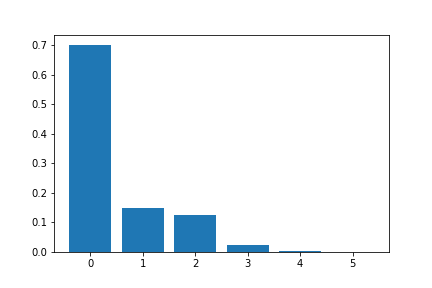
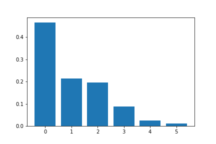

[Think Stats Chapter 3 Exercise 1](http://greenteapress.com/thinkstats2/html/thinkstats2004.html#toc31) (actual vs. biased)

>> REPLACE THIS TEXT WITH YOUR RESPONSE

 Here is the distribution plot 
                                   
                                   

                                   
And here is the biased distribution plot
                                   
                                   
                                   
