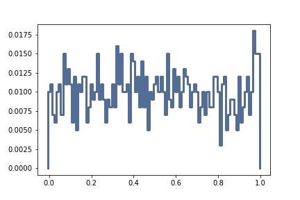
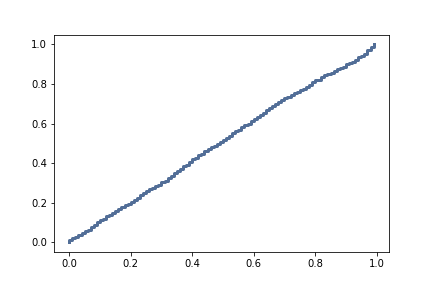

[Think Stats Chapter 4 Exercise 2](http://greenteapress.com/thinkstats2/html/thinkstats2005.html#toc41) (a random distribution)

>> 
Here is the PMF plot

and here is the CDF plot

CDF shows a liner line with slope of one therefore it is a linear distribution.
